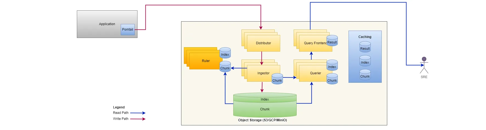
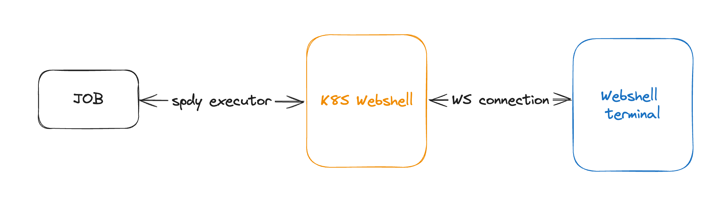

The maintenance (or operations) system primarily serves internal development, operations, and product teams within the company. Its main functions include:
### Task Scheduling Management
Viewing details of tasks submitted by users, Viewing task logs. Pausing and restarting tasks. Monitoring task workloads. Performing web-shell operations on machines where tasks are running.
### Build and deploy tools
- Managing code build.
- Deploying services.
### Machine Metrics and Program Metrics Collection
- Collecting metrics of machine.
- Collecting metrics of program（node-export, jmx_prometheus）

## Technology Architecture
* **Programming Language**：Java, ReactJS
* **Framework**: Spring Boot, Ant Design(UI Framework)
* **Database**: MySQL
* **ORM**: MyBatis
* **Containerization**: Kubernetes
* **Web Server**: Nginx
* **Log&Metrics Collection**: Loki, Prometheus, Grafana
## Architecture
1. **Log&Metrics Collection**  
	
	 I researched log collection methods and chose the Loki + Prometheus + Alertmanager approach.   
	 The Loki developed by the Grafana organization, offers advantages over other log collection services.   
	 Loki is built around the idea of only indexing metadata about your logs: labels (just like Prometheus labels).   
	 Log data itself is then compressed and stored in chunks in object stores such as Amazon Simple Storage Service (S3) or Google Cloud Storage (GCS), or even locally on the filesystem. A small index and highly compressed chunks simplify the operation and significantly lower the cost of Loki.
2. **CI&CD**  
	I directly utilized Cloud Service's code repository API for continuous integration. Deployment was carried out by making Kubernetes API calls to perform service upgrades. This involved updating a Deployment's image to the latest version and then restarting the Deployment.
3. **Webshell**  
	
	* Deploy a k8s-webshell relay service.
	* The webshell terminal establishes a WebSocket connection with k8s-webshell server, and uses namespace, and podname as parameters to represent the pod on which it wants to execute shell operations.
	* When k8s-shell receives a request to establish a connection, it creates a new spdy executor request with the corresponding pod to execute the exec-related operation.
### I am responsible for:
- I built the system from scratch；
- For the front end, I used the Ant Design (antd) framework, which is a React UI component library. 
- For the backend, I developed it using Java + Spring Boot.
