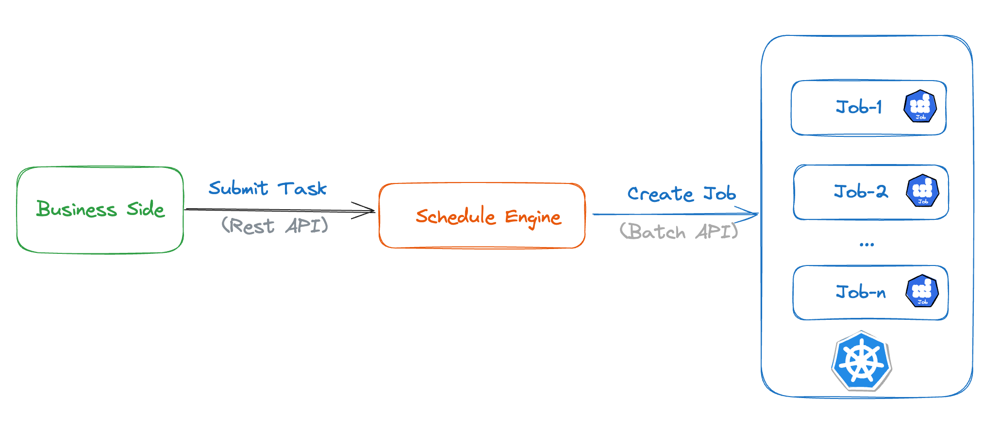

## Task Scheduling engine

Responsible for the overall task and resource scheduling of the platform.
### Resource scheduling
According to the cluster load pressure and node health, dynamically adjust the resource water level, and go online and offline for service nodes.
### Task scheduling
According to the geographic location of the data source, the quality of network access, and the resource load of each node, the task is scheduled to the most suitable node for execution. If the abnormality is detected, the scheduling engine automatically switches the task to a healthy node to ensure stable execution.
### Technology Architecture
* **Programming Language**：Java
* **Framework**: Spring Boot
* **Database**: MySQL
* **ORM**: MyBatis
* **Containerization**: Kubernetes
#### Architecture
1. **Submit Task**
   
   * For each task submitted by different business units, we create a Kubernetes Job.
   * The task's execution region and cloud provider are determined based on the data source's region.
   * Business Side can submit, start, modify, stop, and access tasks via RestAPI.
2. **Task Monitoring**
   
   Monitoring Task Status Changes with Corn Job
   
   **1. Job Watch**
   	* Using watch API to track Jobs's changes
   	  
   **2. Receive Job status**
   	* For resident tasks, the scheduling engine will actively create a WebSocket connection with the Job and receive status change info
   	  
   **3. Iterate over running tasks**
	* Query the database for all running tasks
	* Using ReadJob API to get job info, and then sync the info of the tasks in the system

   **4. Iterate over Job**
	* Using ListJob API to get job info

*When network jitters, service failures and other abnormal situations occur, task status cannot be obtained normally through 1&2 tasks, 3&4 Corn Job will actively obtain the task status as a compensation task.*

3. **Multi Region Architecture**
   
   * The engine is stateless and their deployment is managed through configuration. We use the Deployment approach, and services can be designated as central or unit services.
   * When the business side submits a task, it will bring the region where the database is located, and the engine will schedule the task to the container in the nearest region to reduce network latency.

*Resource scaling for tasks is accomplished by utilizing ServeLess capabilities provided by cloud providers. The addition/deletion of servers is automatic based on resource usage.*
### I am responsible for
1. Integrating with cloud providers like AWS, Microsoft Azure, Google Cloud Platform, Alibaba Cloud, Tencent Cloud, Baidu Cloud, and Huawei Cloud to support users from various cloud providers. Currently, we have one central service and 14 individual unit services.
2. Creating Kubernetes environment deployment scripts to support deployment on cloud providers as well as user-owned IDCs (Internet Data Centers).
3. Developing scheduling status monitoring functionality.
